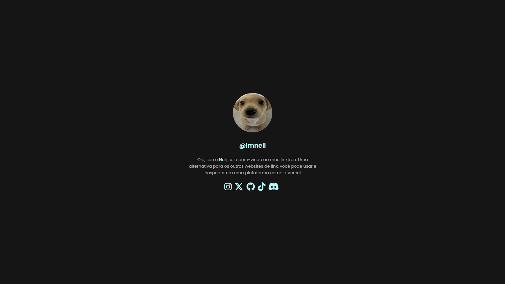

<h1 align="center">Linktree 🍂</h1>
<h3 align="center">Simple site to group all profiles on social networks.</h3>

---

<p align="center">
  
</p>

---

## About the project

This is an open source project that serves as a free alternative to the Linktree website.
- [My Linktree](https://neli-links.vercel.app/)

I used the [ScrollReveal](https://scrollrevealjs.org/) for the animations!

## Getting started

If you installed git you can clone the code to your machine, or download a ZIP of all the files directly.
[Download the ZIP from this location](https://github.com/johnggli/linktree/archive/master.zip), or run the following [git](https://git-scm.com/downloads) command to clone the files to your machine:
```bash
git clone https://github.com/imneli/linktree
```
- Once the files are on your machine, open the folder in [Visual Studio Code](https://code.visualstudio.com/).
- With the files open in Visual Studio Code, Install this extension [Live Server](https://marketplace.visualstudio.com/items?itemName=ritwickdey.LiveServer) after this press the "Go Live" button in the bottom.
- Change the profile image and texts in the `index.html` file.
- Change the colors and fonts in the `style.css` file.
- Change the aniamtions in the `reveal.js`, `revealReset.css` file.


## Youtube Tutorial

### Check the tutorial here -> [Youtube Video](https://www.youtube.com/watch?v=4hCy7Q-x3WE)

---

Made by ImNeli ❤️